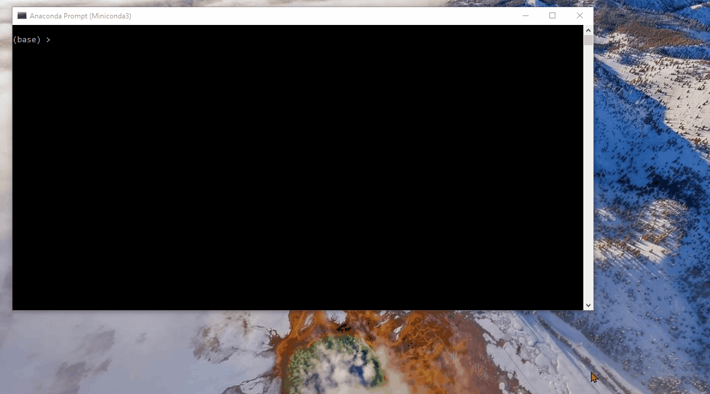
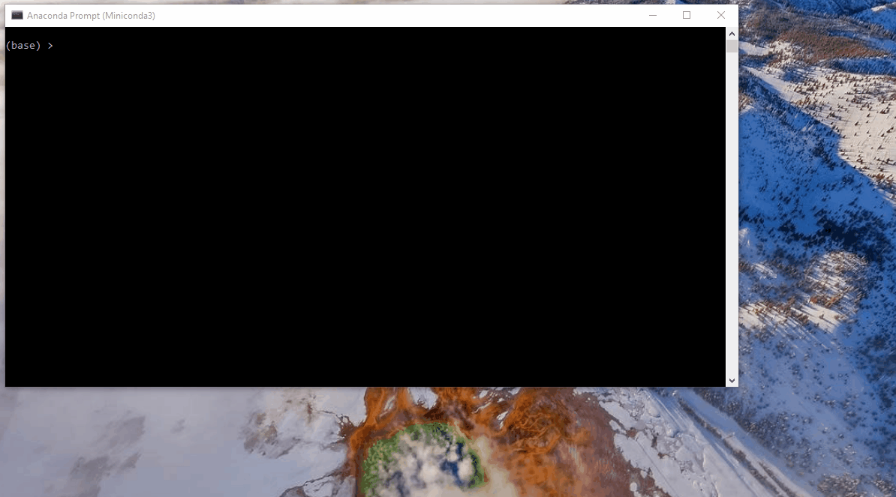
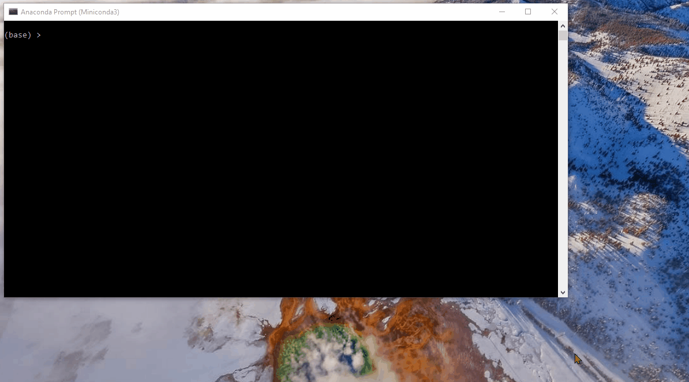

# Search
This is a search project that enables the Pacman agent to find its path in the maze world, to reach a specific location and to collect food efficiently. These searches include:

* Depth First Search
* Breadth First Search
* Uniform Cost Search
* A* Search
* Heuristics
* Suboptimal Search

# Code in Action

In this section, we can see the real implementation of the algorithms and their application to the Pacman world.

## Depth First Search

The following shows how the Pacman can find a fixed food dot using DFS:

## Breadth First Search

The following shows how the Pacman can find a fixed food dot using BFS:

## Uniform Cost Search

The following shows how the Pacman can find a fixed food dot using UCS:

## A* Search & Heuristic

The following shows how the Pacman can find four food dots in the corners using A* with heuristic:

## Suboptimal Search

The following shows how the Pacman acts greedy to eat closest dots first:

